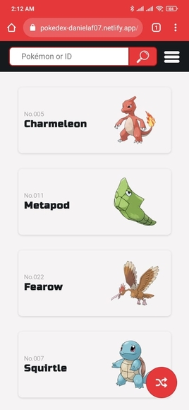
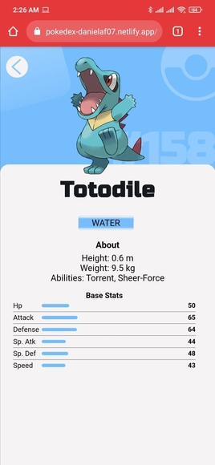
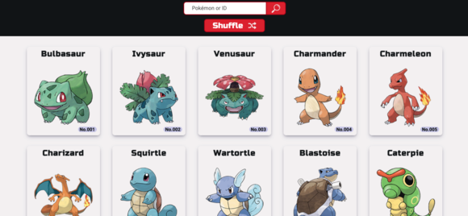
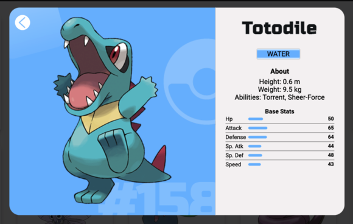

# PokéDex App

Dependecias: Ir al folder del proyecto y escribir el siguiente comando:

  * npm install
 
 y ejecuta con el comando: 

  * npm start

Es todo!

Para compilar para producción:
 
 * npm run build

y subir la carpeta build a producción.
 
 ## Cómo funciona?
  * Presiona sobre el Pokémon que más te agrade y mira los detalles acerca de él.
  * Conoce nuevos Pokémon con el botón de "Shuffle"
 
 ## Algunas imagenes:
 
 
 
 
 
